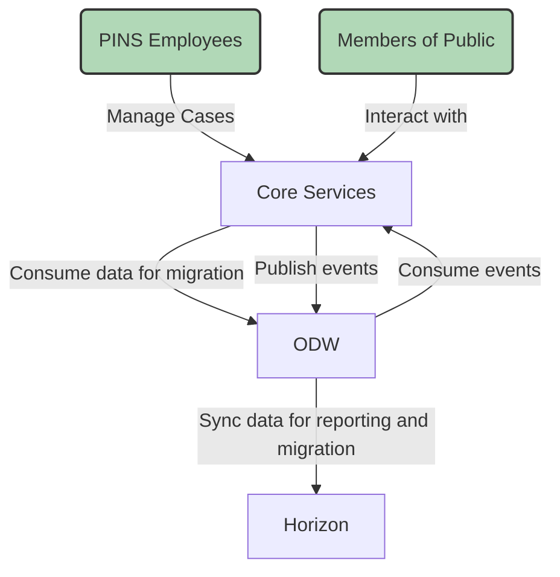
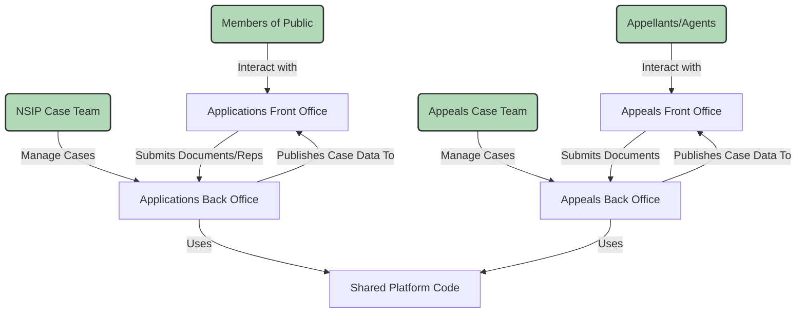
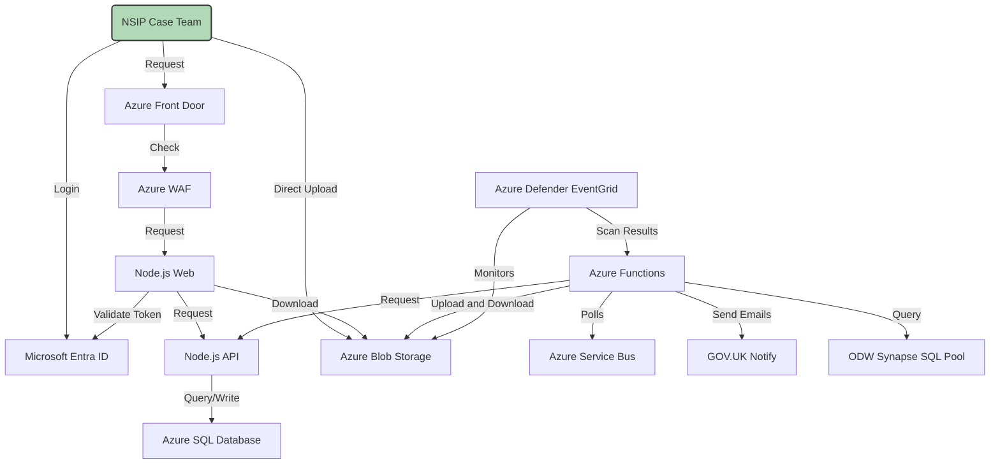

# C4 Architecture

## High-level System Context

```mermaid
graph TD
    classDef userStyle fill:#B1D8B7,stroke:#333,stroke-width:2px;

    CS[Core Services]
    ODW[ODW]
    HZN[Horizon]
    Employees(PINS Employees):::userStyle
    Public(Members of Public):::userStyle

    Employees -->|Manage Cases| CS
    Public -->|Interact with| CS

    CS -->|Consume data for migration| ODW
    CS -->|Publish events| ODW
    ODW -->|Consume events| CS

    ODW -->|Sync data for reporting and migration| HZN
```

## Core Services System Context

```mermaid
graph TD
    classDef userStyle fill:#B1D8B7,stroke:#333,stroke-width:2px;

    AppsFO[Applications Front Office]
    AppsBO[Applications Back Office]
    AppsCaseTeam(NSIP Case Team):::userStyle
    AppsPublic(Members of Public):::userStyle

    ApplsFO[Appeals Front Office]
    ApplsBO[Appeals Back Office]
    ApplsCaseTeam(Appeals Case Team):::userStyle
    ApplsPublic(Appellants/Agents):::userStyle

    SharedPlatform[Shared Platform Code]

    AppsCaseTeam -->|Manage Cases| AppsBO
    AppsPublic -->|Interact with| AppsFO
    AppsFO -->|Submits Documents/Reps| AppsBO
    AppsBO -->|Publishes Case Data To| AppsFO
    AppsBO -->|Uses| SharedPlatform

    ApplsCaseTeam -->|Manage Cases| ApplsBO
    ApplsPublic -->|Interact with| ApplsFO
    ApplsFO -->|Submits Documents| ApplsBO
    ApplsBO -->|Publishes Case Data To| ApplsFO
    ApplsBO -->|Uses| SharedPlatform
```

## Applications Back Office Components

```mermaid
graph TD
    classDef userStyle fill:#B1D8B7,stroke:#333,stroke-width:2px;

    AppsCaseTeam(NSIP Case Team):::userStyle
	FD[Azure Front Door]
	WAF[Azure WAF]
	ENTRA[Microsoft Entra ID]
    WEB[Node.js Web]
    API[Node.js API]
    DB[Azure SQL Database]
	BLOB[Azure Blob Storage]
	SB[Azure Service Bus]
	EGRID[Azure Defender EventGrid]
	AZFNS[Azure Functions]
	GNF[GOV.UK Notify]
	SYN[ODW Synapse SQL Pool]

    AppsCaseTeam -->|Login| ENTRA
    AppsCaseTeam -->|Request| FD
	AppsCaseTeam -->|Direct Upload| BLOB
	FD -->|Check| WAF
	WAF -->|Request| WEB
	WEB -->|Validate Token| ENTRA
	WEB -->|Download| BLOB
	WEB -->|Request| API
	API -->|Query/Write| DB
	AZFNS -->|Request| API
	AZFNS -->|Query| SYN
	AZFNS -->|Polls| SB
	AZFNS -->|Upload and Download| BLOB
	EGRID -->|Scan Results| AZFNS
	EGRID -->|Monitors| BLOB
	AZFNS -->|Send Emails| GNF
```
