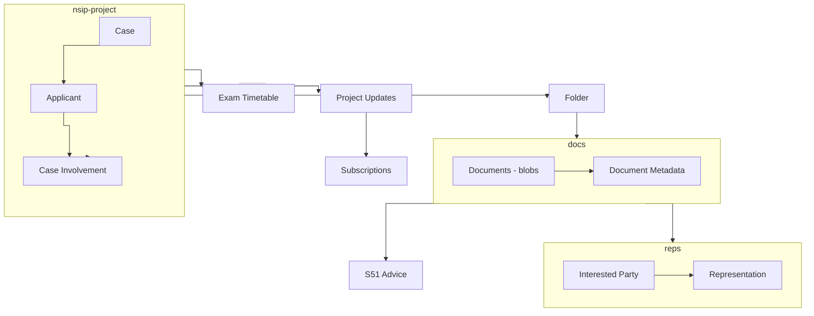

# Case Migration

We have to migrate case entities in a particular order to handle their relations, as per the diagram below:

```mermaid
%%{ init: { 'flowchart': { 'curve': 'stepAfter' } } }%%
flowchart TD
    applicant[Applicant]
    project[Case]
    involve[Case Involvement]

    folder[Folder]
    documents[Documents - blobs]
    documentMeta[Document Metadata]
    s51[S51 Advice]

    ip[Interested Party]
    rep[Representation]

    exam[Exam Timetable]


    updates[Project Updates]
    subs[Subscriptions]

    subgraph case[nsip-project]
        project --> applicant --> involve
    end


    subgraph docs
        documents --> documentMeta
    end

    case --> folder --> docs

    docs --> s51

    subgraph reps
        ip --> rep
    end

    docs --> reps

    case --> exam

    case --> involve

    case -->|from NI| updates --> subs
```