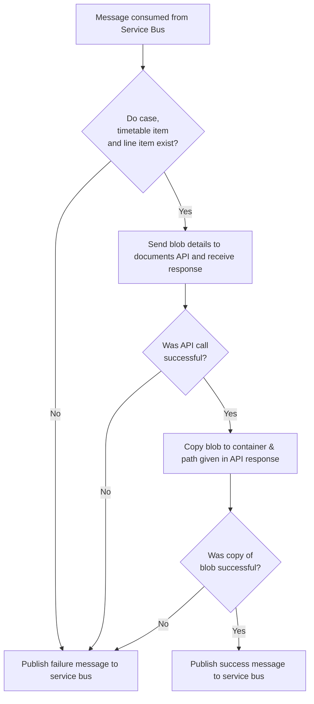

# deadline-submissions function

This Azure function is responsible for consuming messages from the front office via Service Bus which inform us of when a user uploads a new submission against a timetable item/line item.

## Flow

# Handle Subscriptions

Users can subscribe to updates for an NSIP project. The front-office handles the user form, and email verification.

The front-office will send a command via Service Bus for `register-nsip-subscription`. The back-office will save the subscription information, and publish the created `nsip-subscription` on Service Bus.

This function handles the command, saves the subscription, and publishes the event.
