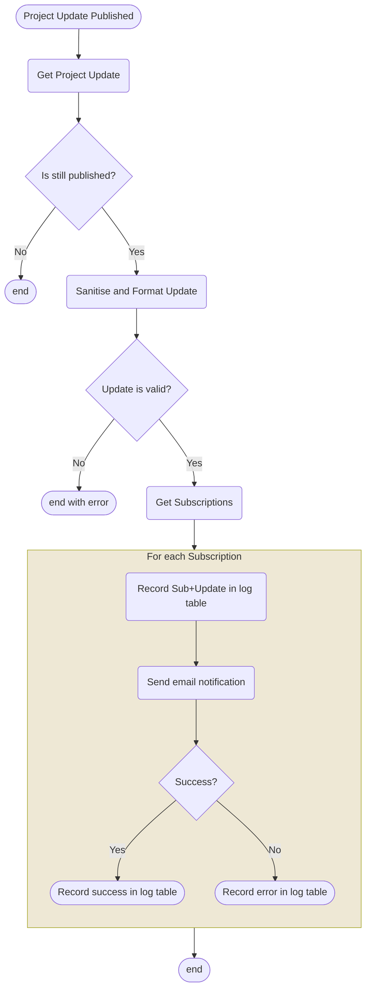

# Notify Subscribers

Some actions in the Back Office require a notification to be sent to subscribers. For example, when a Project Update is published all subscribers will be notified, via Gov Notify. This function implements that functionality.

## Process Outline

When a Project Update is published, a scheduled message is sent 

Note: "log" here doesn't mean a log message, but a log of notification sending activity.

