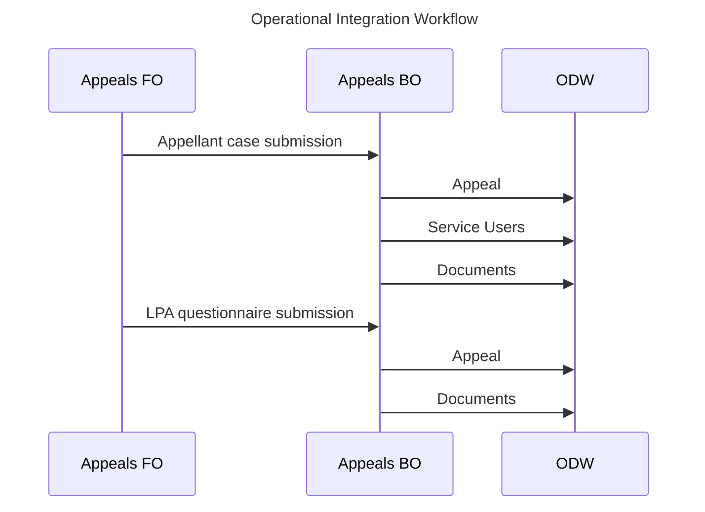

# ODT Integrations (Appeals FO <-> BO)

## Incoming Commands

The Appeals FO will emit command events to Service Bus Topics to indicate the submission of a new appeal, and the response from the LPA. The Appeals BO actively listen to the specified Service Bus topic, and will publish the extracted ODW entities in the specified Service Bus topic.

## Ingestion topics

| Topic Name                        | Version | Payload Schema                                                                             | Producer(s) | Known Consumers |
| --------------------------------- | ------- | ------------------------------------------------------------------------------------------ | ----------- | --------------- |
| appeal-fo-appellant-submission    | 0.1     | [Appellant Case](../appeals/api/src/message-schemas/pins-appellant-case.schema.json)       | Appeals FO  | Appeals BO      |
| appeal-fo-lpa-response-submission | 0.1     | [LPA Questionnaire](../appeals/api/src/message-schemas/pins-lpa-questionnaire.schema.json) | Appeals FO  | Appeals BO      |

---

> [!IMPORTANT]
> The events produced by the Appeals BO are described in the [Event Repository](./event-repository.md).
