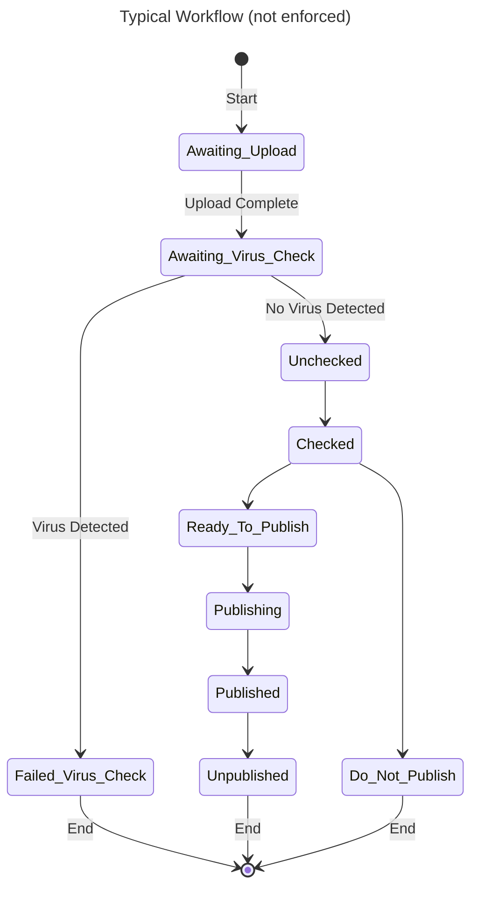
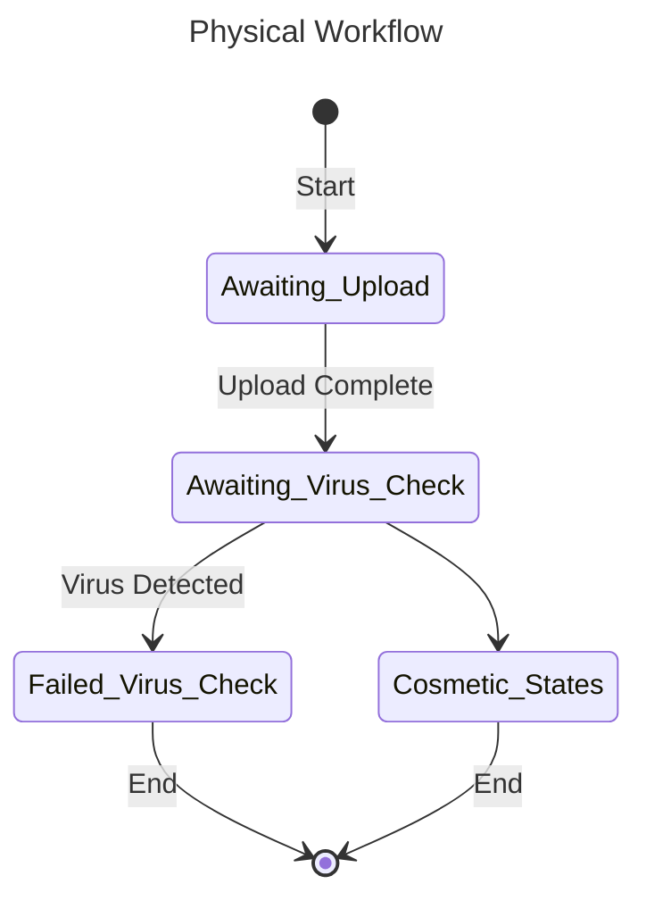

# Document State Transitions

```mermaid
---
title: Typical Workflow (not enforced)
---

stateDiagram
    [*] --> Awaiting_Upload: Start
    Awaiting_Upload --> Awaiting_Virus_Check: Upload Complete
    Awaiting_Virus_Check --> Failed_Virus_Check: Virus Detected
    Failed_Virus_Check --> [*]: End
    Awaiting_Virus_Check --> Unchecked: No Virus Detected
    Unchecked --> Checked
    Checked --> Ready_To_Publish
    Ready_To_Publish --> Publishing
    Publishing --> Published
    Published --> Unpublished
    Unpublished --> [*]: End
    Checked --> Do_Not_Publish
    Do_Not_Publish --> [*]: End
```

```mermaid
---
title: Physical Workflow
---

stateDiagram
    [*] --> Awaiting_Upload: Start
    Awaiting_Upload --> Awaiting_Virus_Check: Upload Complete
    Awaiting_Virus_Check --> Failed_Virus_Check: Virus Detected
    Failed_Virus_Check --> [*]: End
    Awaiting_Virus_Check --> Cosmetic_States
    Cosmetic_States --> [*]: End
```
