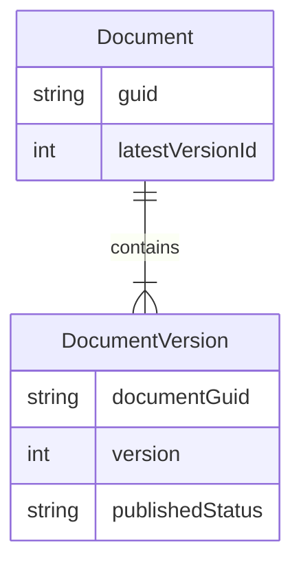

# Relationship between Documents and DocumentVersions

A Document serves as a container for DocumentVersions. The meaningful information (like title, description, status, etc.) is stored in the DocumentVersion.

When information about a document is requested, and a particular version is not specified, it should use the latest version.

## Relationship

**Note:** The diagram doesn't show an exhaustive list of the entities' attributes.



## Behaviour

**Unpublish behaviour:**

```mermaid
%%{ init: { 'flowchart': { 'curve': 'linear' } } }%%
flowchart TD
    call["Call API to unpublish document"]
    find{{"Is there a published version?"}}
    err["Return an error"]
    change["Change this version's status to 'not_checked'"]

    call --> find
    find -- No --> err
    find -- Yes --> change
```
