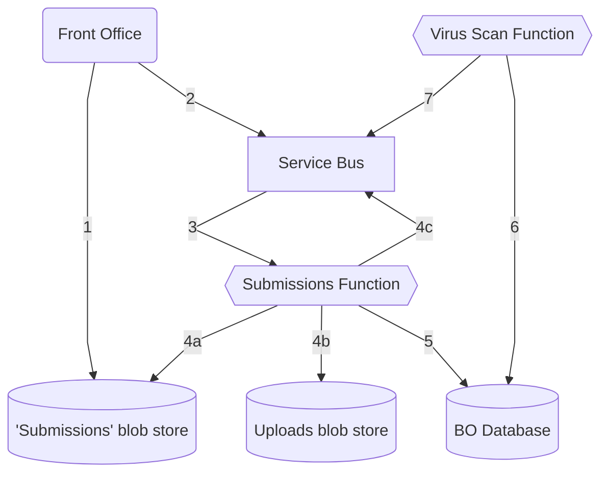

# Examination Timetable Submissions From Front Office

The front office allows users to make submissions (upload files) against specific line items in an exam timetable. These are then passed on to us via Azure Service Bus to be stored in the back office.

## How the messages are processed

1. Front office writes documents to the shared blob store
2. Front office publishes a message to Service Bus with a list of documents and the timetable items and line items they relate to
3. Message consumed from Service Bus by an Azure function
4. (a) Azure function downloads files from the shared blob storage
   (b) Azure function writes downloaded files to the uploads blob storage
   (c) If failed above failed, Azure function writes a failure message to Service Bus
5. Azure function adds new rows to the database for each new document
6. Virus check function runs on new documents
7. Publish success or failure of virus check to Service Bus

